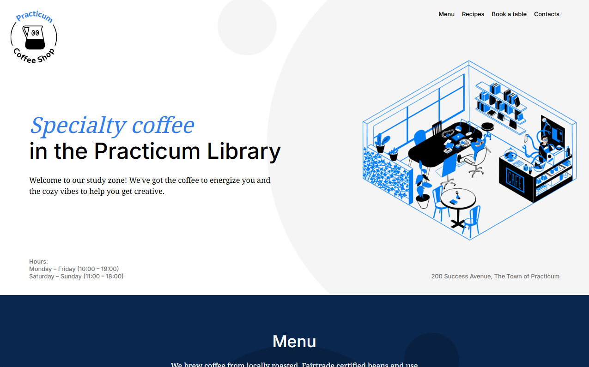
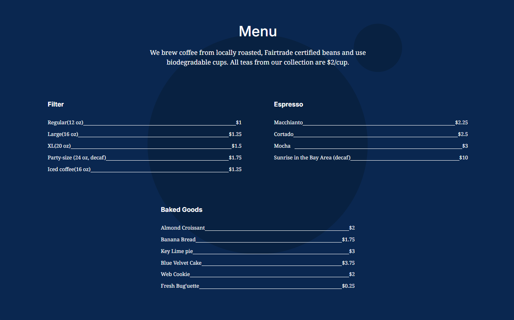
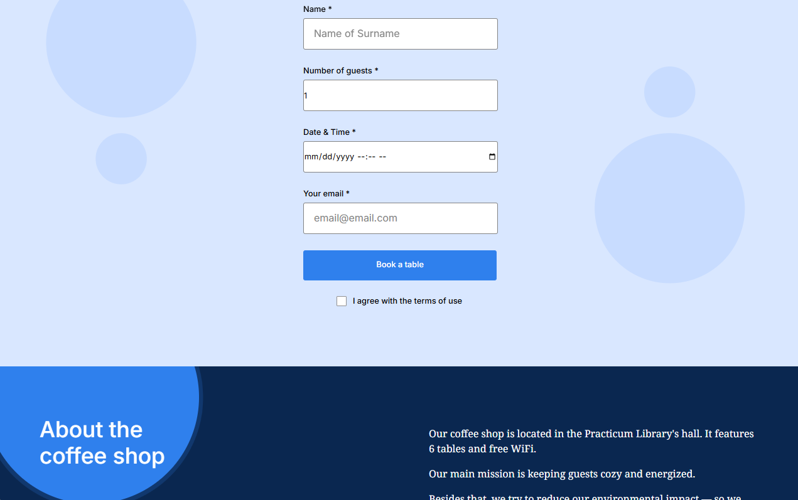

# **Practicum Coffee Shop** ☕️✨

This project showcases a modern, responsive coffee shop website developed as part of the **Software Engineering program at Tripleten**. Built using **HTML** and **CSS**, the design follows a provided brief and demonstrates clean, efficient front-end development practices.

---

## **Core Features**
- **Semantic HTML5**: Structured with modern, accessible HTML5 elements.
- **Flexbox**: Utilized for creating responsive and adaptive layouts.
- **Precise Positioning**: Strategic use of CSS positioning for optimal alignment.
- **BEM Methodology**: Organized CSS structure with **BEM** (Block, Element, Modifier) for scalability.
- **Custom Form**: A fully functional, user-friendly custom form.
- **CSS Animations & Transforms**: Elegant animations and transitions to enhance the user experience.

---

## **Planned Enhancements**
1. **Responsive Design**: Enhance responsiveness for a more polished experience across different devices.
2. **Additional Pages**: Expand functionality by adding new pages to provide a more comprehensive website experience.

---

## **View the Live Project**
Explore the live site here:  
[**Practicum Coffee Shop - Live Site**](https://your-project-link.com)
